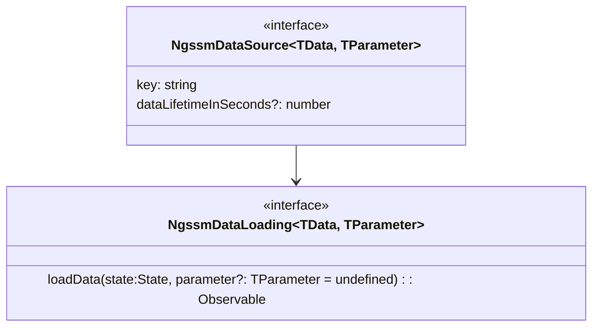
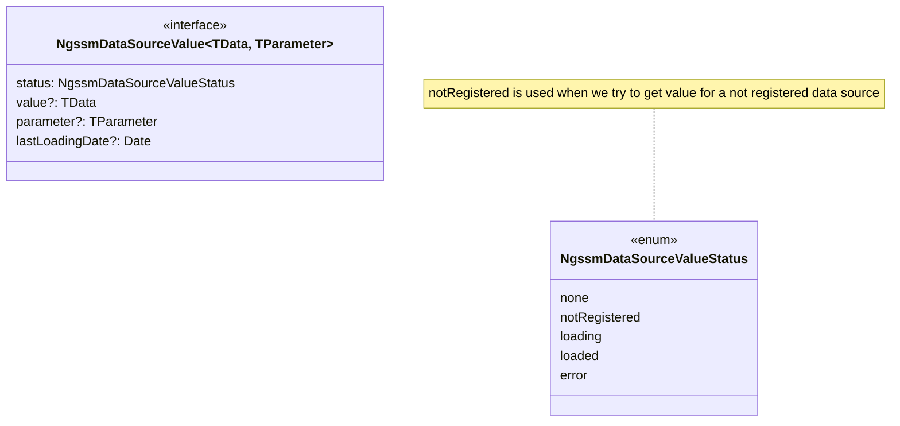
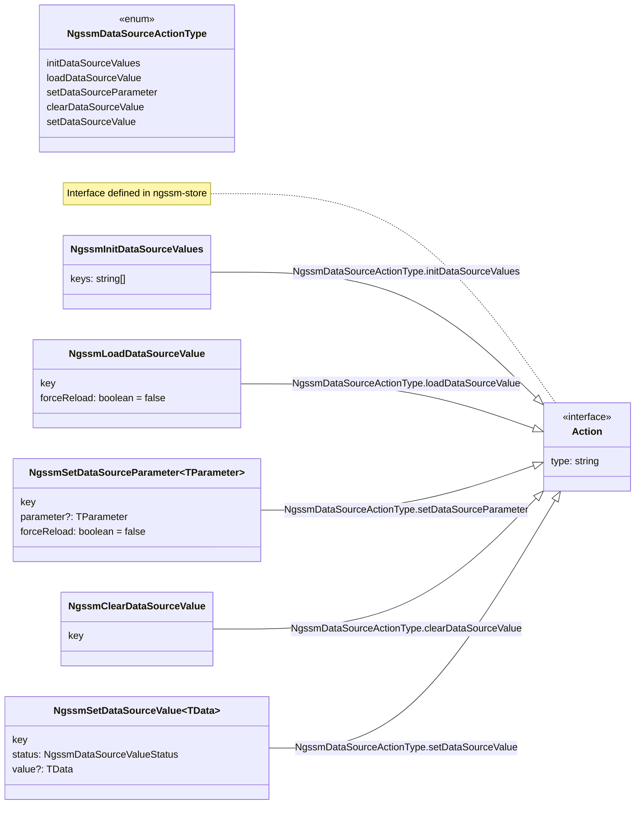

# ngssm-data

This library provides states, components and helpers to simplify management of data loaded from remote services or computed from any source.

To use it, simply add **provideNgssmData()** in *app.config.ts*.

```javascript
export const appConfig: ApplicationConfig = {
  providers: [
    ....
    provideNgssmData();
    ....
  ]
};
```

!!! Note

    This library is provided as a replacement of **ngssm-remote-data**.


!!! Warning

    This library is currently under development.

## Data Source

A data source is defined as:



- **key**: unique identifer of the data source;
- **dataLifetimeInSeconds**: lifetime of the stored data in seconds;
- **loadData**: a function used to load the data. The *parameter* is optional.

The data source must be registered with the function *provideNgssmDataSource*.

```javascript
const dataLoader:NgssmDataLoading<string[], number> = (state:State, parameter?:number) : Observable<string[]> => {
    const query = selectMyQuery(state);
    return inject(HttpClient).post<string[]>(`${baseUrl}/${parameter}`, query);
}

export const appConfig: ApplicationConfig = {
  providers: [
    provideNgssmDataSource('doc:example:data', dataLoader, 6000);
  ]
};
```

The value of a data source is stored in state as **NgssmDataSourceValue**



It can be retrieved by

```javascript
const value:NgssmDataSourceValue = selectNgssmDataSourceValue(state, 'doc:example:data');
```

If we want to get a signal instead of the value:

```javascript
const valueSignal:Signal<NgssmDataSourceValue> = selectNgssmDataSourceValueSignal(store, 'doc:example:data');
```

## Actions

Some actions are provided by the library to manage the data source.



```javascript
store.dispatchAction(new NgssmLoadDataSourceValue('doc:example:data', true));
store.dispatchAction(new NgssmSetDataSourceParameter('doc:example:data', 567));
store.dispatchAction(new NgssmClearDataSourceValue('doc:example:data'));
store.dispatchAction(new NgssmSetDataSourceValue('doc:example:data', NgssmDataSourceValueStatus.loaded, ['val1', 'val2']));
```

!!! Note

    *NgssmInitDataSourceValues* and *NgssmSetDataSourceValue* should not be called by the application. These actions are used by the library at startup
    and after the execution of the data source loading function.

## Guard

In case we need to reload the value of a data source when going to a given page, we can use the function *ngssmLoadDataSourceValue*.

```javascript
export const myRoutes:Routes = [
    {
        path: 'example',
        component: ExampleComponent,
        canActivate : [
            ngssmLoadDataSourceValue('doc:example:data', false)
        ]
    }
]
```

The function will simply inject the store and dispatch the action **NgssmLoadDataSourceValue**.

## Pipe

The pipe *isNgssmDataSourceValueStatus* is provided to allow updating the ui according to the status of a given data source value.

```html
@if ( store.state() | isNgssmDataSourceValueStatus:'doc:example:data':'loading') {
    <p>The data is being loaded</p>
} @else {
    <div>Display the data</div>
}
```
