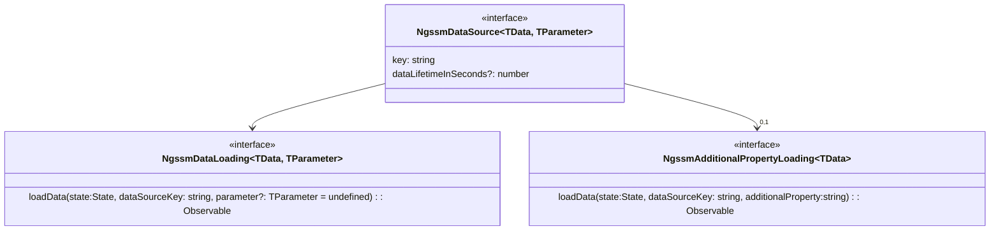
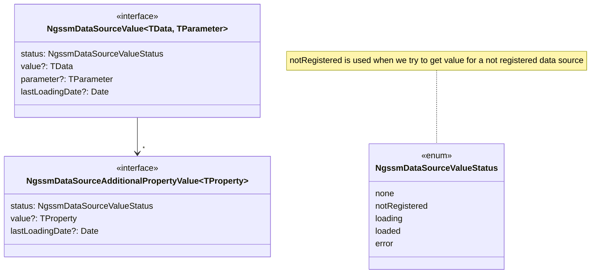

# Overview

This library provides states, components and helpers to simplify management of data loaded from remote services or computed from any source.

To use it, simply add **provideNgssmData()** in _app.config.ts_.

```javascript
export const appConfig: ApplicationConfig = {
  providers: [
    ....
    provideNgssmData();
    ....
  ]
};
```

!!! Note

    This library is provided as a replacement of **ngssm-remote-data**.

!!! Warning

    This library is currently under development.

## Data Source

A data source is defined as:



- **key**: unique identifer of the data source;
- **dataLifetimeInSeconds**: lifetime of the stored data in seconds;
- **loadData**: a function used to load the data. The _parameter_ is optional.

The data source must be registered with the function _provideNgssmDataSource_.

```javascript
const dataLoader:NgssmDataLoading<string[], number> = (state:State, parameter?:number) : Observable<string[]> => {
    const query = selectMyQuery(state);
    return inject(HttpClient).post<string[]>(`${baseUrl}/${parameter}`, query);
}

export const appConfig: ApplicationConfig = {
  providers: [
    provideNgssmDataSource('doc:example:data', dataLoader, {dataLifetimeInSeconds: 6000});
  ]
};
```

A data source could also be added by using the action **NgssmRegisterDataSource**. It could then be removed with the action **NgssmUnregisterDataSource**.

The value of a data source is stored in state as **NgssmDataSourceValue**



!!! Note "Additional properties of a data source"

    Sometimes, some properties of the data source are not loaded at the same time as the data source itself.
    It's the case when we want to load detail part only when the user asks for it.

It can be retrieved by

```javascript
const value:NgssmDataSourceValue = selectNgssmDataSourceValue(state, 'doc:example:data');
```

Additional properties could be retirved from the data source value or by

```javascript
const propertyValue:NgssmDataSourceAdditionalPropertyValue = selectNgssmDataSourceAdditionalPropertyValue(state, 'doc:example:data', propertyName);
```

## Actions

Some actions are provided by the library to manage the data source.

```typescript

```

```javascript
store.dispatchAction(new NgssmLoadDataSourceValueAction('doc:example:data', { forceReload: true }));
store.dispatchAction(new NgssmSetDataSourceParameterAction('doc:example:data', 567));
store.dispatchAction(new NgssmClearDataSourceValueAction('doc:example:data'));
store.dispatchAction(new NgssmSetDataSourceValueAction('doc:example:data', NgssmDataSourceValueStatus.loaded, ['val1', 'val2']));
```

!!! Note

    *NgssmSetDataSourceValueAction* should not be called by the application. This action is used by the library after the execution of the data source loading function.

!!! Note

    *NgssmRegisterDataSourcesAction* is used to register a list of data sources.

    At startup, the library registers itself the sources provided with the method *provideNgssmDataSource*.

    The action could be dispatch by the application when source is not known at startup or needs not to be defined at startup.

    If *NgssmRegisterDataSourcesAction* is dispatched for a data source already registered, nothing is done by the library.

## Guard

In case we need to reload the value of a data source when going to a given page, we can use the function _ngssmLoadDataSourceValue_.

```javascript
export const myRoutes:Routes = [
    {
        path: 'example',
        component: ExampleComponent,
        canActivate : [
            ngssmLoadDataSourceValue('doc:example:data', false)
        ]
    }
]
```

The function will simply inject the store and dispatch the action **NgssmLoadDataSourceValueAction**.

## Pipe

The pipe _isNgssmDataSourceValueStatus_ is provided to allow updating the ui according to the status of a given data source value.

```html
@if ( store.state() | isNgssmDataSourceValueStatus:'doc:example:data':'loading') {
<p>The data is being loaded</p>
} @else if ( store.state() | isNgssmDataSourceValueStatus:'doc:example:data':'loaded':'error'){
<div>Display the data</div>
}
```

## Components

- **ngssm-data-reload-button**

  - used to reload a list of data sources;
  - inputs:

    - dataSourceKeys: string[] => the keys of the data sources managed by the button;
    - keepAdditionalProperties: boolean => if true, additional properties are not cleared when reloading data;
    - buttonIcon: string => css class to override default reload icon.
