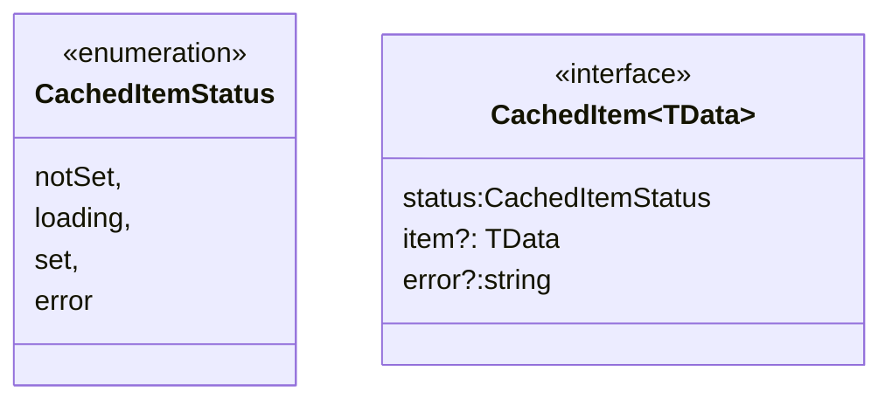

# ngssm-store/caching

Helper to cache any object in the state without the need of implemented a specfic state with a specific reducer and specific actions.

To use it, simply add **provideNgssmCaching()** in *app.config.ts*.

```javascript
export const appConfig: ApplicationConfig = {
  providers: [
    ....
    provideNgssmCaching();
    ....
  ]
};
```

The data are stored as a `CachedItem<TData>`.



To set or unset the cached item, the following actions are provided:

- `SetCachedItemAction<TData = any>`:

    - *cachedItemKey* of type string is the key used as unique identifier of the cached item;
    - *cachedItem* as `Partial<CachedItem<TData>>`. If the key does not exist, the value is set in the state. Otherwise, a merge is done with the value set in state.

- `UnsetCachedItemAction`:

    - *cachedItemKey*. The cached item is removed from the state.

To retrieve the cached item from the state, the function *selectNgssmCachedItem* is provided.

```javascript
export const selectNgssmCachedItem = <T>(state: State, key: string): CachedItem<T> | undefined
```