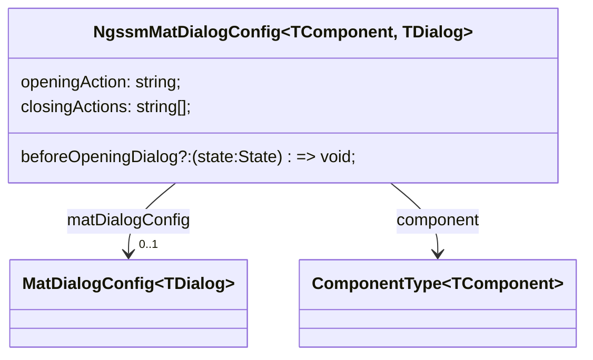

# ngssm-toolkit

This library provides helpers to avoid redundant code.

## Dialog Helper

Helper used to open and close any component as dialog when some actions are triggered.

To use this helper, the **provideNgssmMatDialog** function must be called in **app.config**.

The feature can be configured through the function **provideNgssmMatDialogConfigs** with the input configuration:

- *component* is the component to be displayed as dialog;
- *matDialogConfig* is the options used by the **MatDialog** service to open the component as dialog;
- *openingAction* is the action triggering the rendering of the dialog;
- *closingActions* are the actions triggering the dialog to close.

!!! Note

    For now, an action can only close one dialog. The same action cannot be used to close different dialogs.
