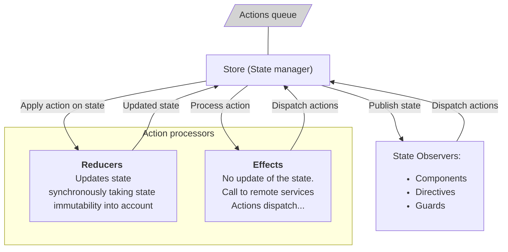
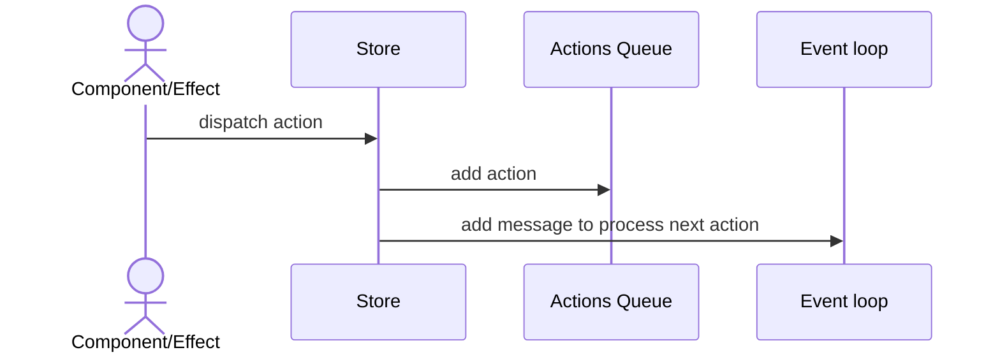
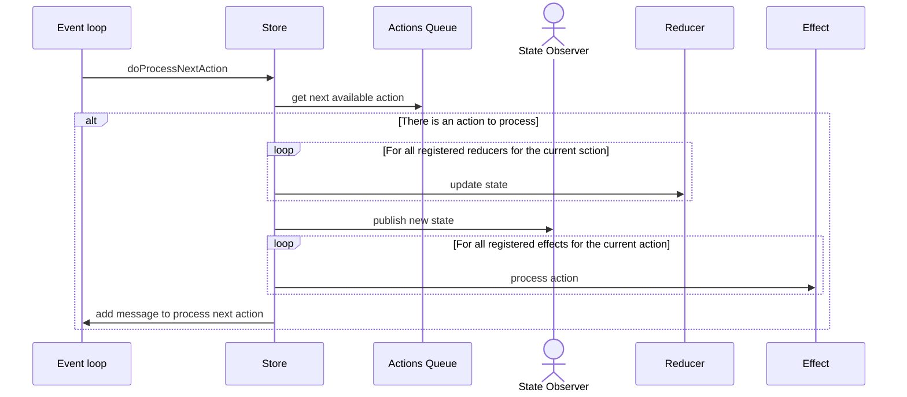

# State management

This is a simple custom adaptation and implementation of the **redux** pattern.

## Store Overview

### Action dispatching

> An action dispatched by a component or an effect is not processed immediately. The store uses the `setTimeout` function to process "later" the action.

### Action processing

## Dependencies

- [angular](https://github.com/angular/angular): the library uses the dependency injection system provided by **angular**,
- [rxjs](https://rxjs.dev/): the publish/subscribe pattern is implemented with **rxjs**,
- [immutability-helper](https://github.com/kolodny/immutability-helper): used by the reducers to update safely the state

> The state must be immutable. But, to simplify the implementation, it is the responsibility of the user to be sure that the state instance is never updated.

- [schematics](https://www.npmjs.com/package/@angular-devkit/schematics): schematics are provided to create feature state, components, reducers, effects, actions...
- [mermaid.js](https://mermaid-js.github.io/mermaid/#/) for the documentation.

## Schematics

See [ngssm-schematics](/projects/ngssm-schematics/README.md) for schematics used to create feature state, action, reducer, effect...
